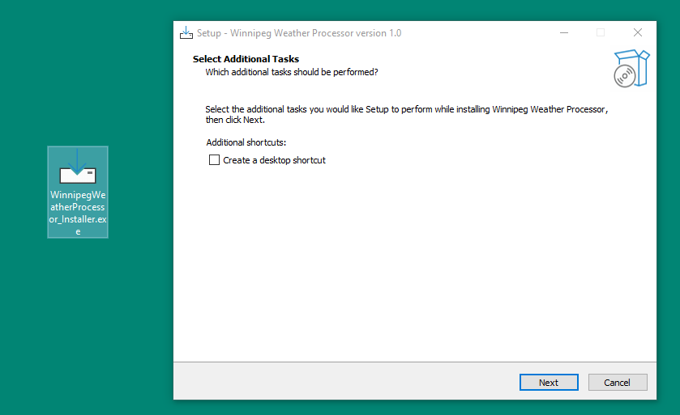
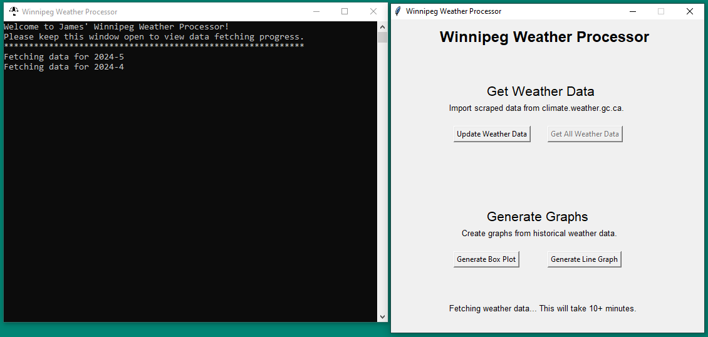
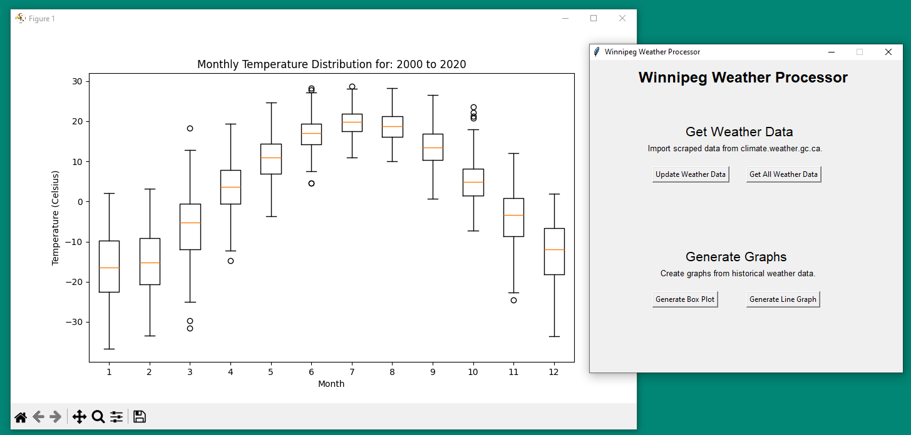
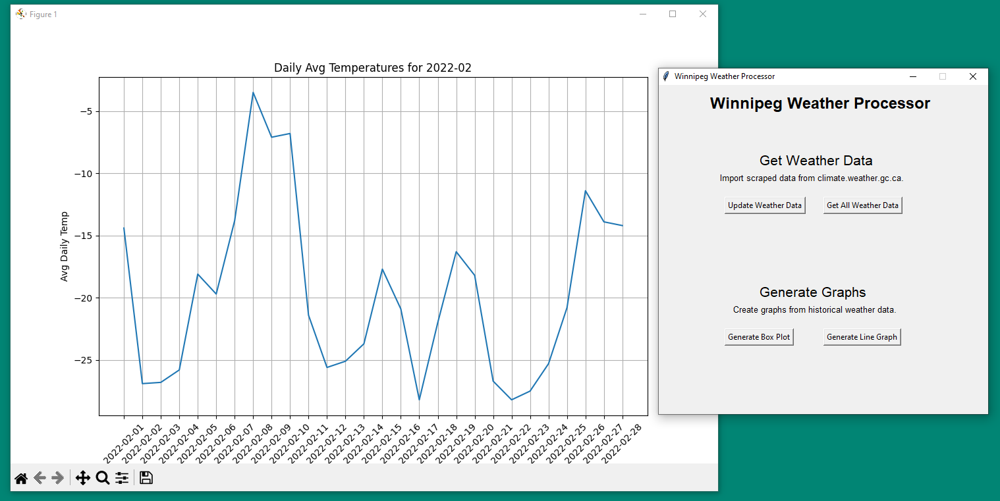

# WinnipegWeatherProcessor

WinnipegWeatherProcessor is a web scraper and data visualization tool built in Python that gathers and builds sophisticated graphs of Winnipeg's historical weather data.

All weather data is scraped [here](https://climate.weather.gc.ca/) and is visualized using the matplotlib Python module.

## Installation

To install this program, simply run the `WinnipegWeatherProcessor_Installer.exe` file included in the installer folder.

## Scrape Data

WinnipegWeatherProcessor comes installed with Winnipeg weather data from September 1966 to April 2024. To update your weather data, click the "Update Weather Data" button to grab recent updates from [Climate Canada](https://climate.weather.gc.ca/).
If you would like to fetch all data, from present day all the way back to the first available record, click the "Get All Weather Data" button.
The CLI window will keep progress of the web scraping process, which runs in a background thread.

## Generate Graphs

WinnipegWeather processor can generate both box plots and line graphs.
To generate a box plot, click "Generate Box Plot" and enter a starting and ending year. A monthly temperature distribution between the two entered years will be generated.

To generate a line graph, click "Generate Line Graph", and enter a year and month. A line graph of the recorded average daily temperatures for that month will be generated.

